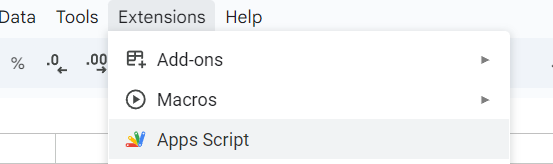
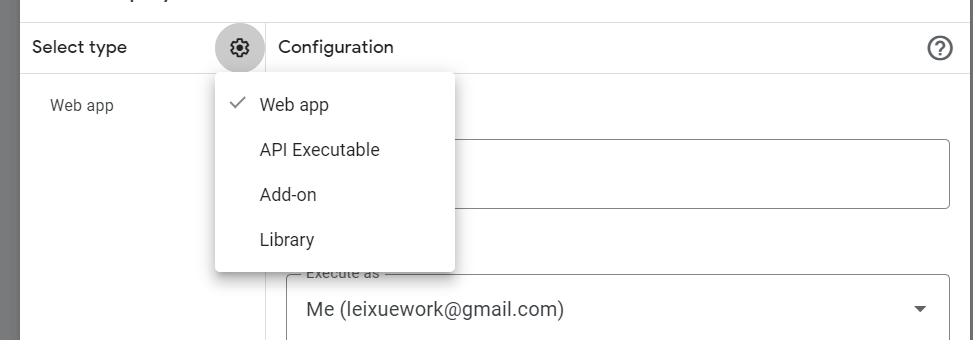
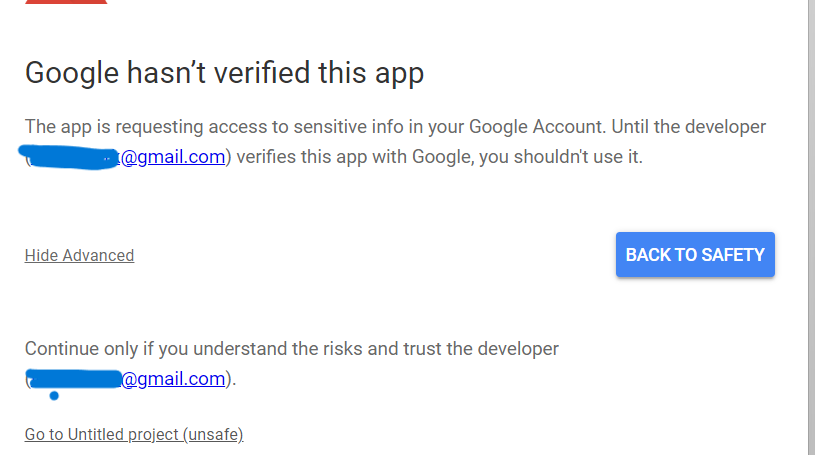
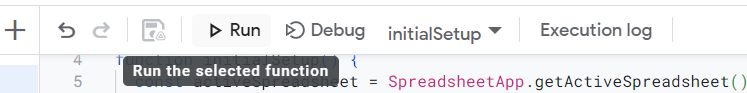

# **Somerville Dental App Documentation**

This is a dental management application built using the **React** framework. The app is hosted on Netlify, and you can access it here:  
👉 [https://somerville-dental.netlify.app](https://somerville-dental.netlify.app)

---

## **Subscription Functionality**

To test the subscription functionality, you can submit an email and verify if it is successfully added to the Google Sheet. Additionally, users can **delete** any row in the sheet (except the header row), providing a convenient way for clients to manage their database efficiently.
📊 **Google Sheet Link:** [View Sheet](https://docs.google.com/spreadsheets/d/1P2Aqylf4OMWgg3uN3jsCce6Tb2mZWHZzWY50Cq4w1m4/edit?gid=0#gid=0)  
⏰ **Note:** The timestamp uses the **New York time zone**.

---

## **How to Set Up Google Sheets API**

Follow these steps to integrate Google Sheets API with the app:

### **Step 1: Create a Google Sheet**

1. Create a new blank Google Sheet.
2. Add the following headers in the first row:

   | **email** | **Timestamp** |
   | --------- | ------------- |

---

### **Step 2: Open Google Apps Script**

1. Go to `Extensions` > `Apps Script`.  
   
2.

---

### **Step 3: Add the Script**

Copy and paste the following script into the Apps Script editor:

```javascript
const sheetName = "Sheet1";
const scriptProp = PropertiesService.getScriptProperties();

function initialSetup() {
  const activeSpreadsheet = SpreadsheetApp.getActiveSpreadsheet();
  scriptProp.setProperty("key", activeSpreadsheet.getId());
}

function doPost(e) {
  const lock = LockService.getScriptLock();
  lock.tryLock(10000);

  try {
    const data = JSON.parse(e.postData.contents);
    const email = data.email;
    if (!email) {
      throw new Error("Email parameter is missing");
    }

    const doc = SpreadsheetApp.openById(scriptProp.getProperty("key"));
    const sheet = doc.getSheetByName(sheetName);
    const headers = sheet
      .getRange(1, 1, 1, sheet.getLastColumn())
      .getValues()[0];
    const nextRow = sheet.getLastRow() + 1;

    const newRow = headers.map(function (header) {
      if (header === "Timestamp") {
        return getMATime();
      } else if (header === "email") {
        return email;
      } else {
        return "";
      }
    });

    sheet.getRange(nextRow, 1, 1, newRow.length).setValues([newRow]);

    return ContentService.createTextOutput(
      JSON.stringify({ result: "success", row: nextRow, email: e.postData })
    ).setMimeType(ContentService.MimeType.JSON);
  } catch (e) {
    return ContentService.createTextOutput(
      JSON.stringify({ result: "error", error: e.message })
    ).setMimeType(ContentService.MimeType.JSON);
  } finally {
    lock.releaseLock();
  }
}

function getMATime() {
  const date = new Date();
  const timeZone = "America/New_York";
  const formattedDate = Utilities.formatDate(
    date,
    timeZone,
    "yyyy-MM-dd HH:mm:ss"
  );
  return formattedDate;
}
```

---

### **Step 4: Deploy the Script**

1. Click `Deploy` > `New Deployment`.
2. Select **Web App** as the deployment type.  
   
3. Add a description and set **"Who has access"** to `Anyone` .
4. Click `Deploy`.

---

### **Step 5: Authorize the Script**

1. When prompted, click **Authorize**.
2. Go to **Advanced** > **Go to Untitled Project (unsafe)** and allow access.  
   

---

### **Step 6: Copy Web App URL**

1. After deployment, copy the **Web App URL**.
2. Paste it into the `.env` file of the React project.

---

### **Step 7: Run Initial Setup**

1. Click the **Run** button in the Apps Script editor to execute the `initialSetup` function.  
   

---
